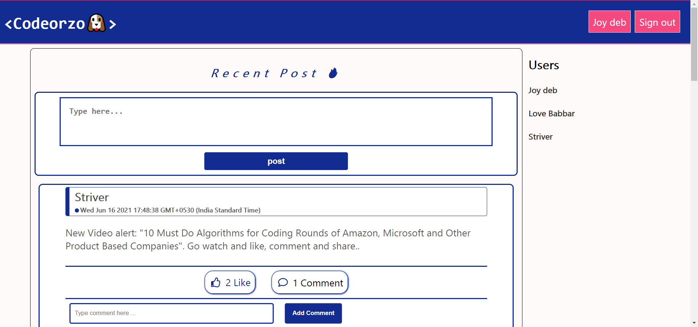
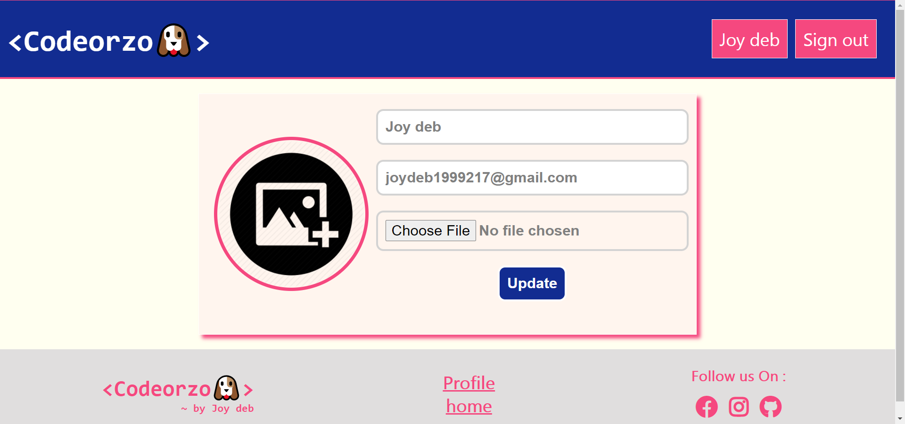
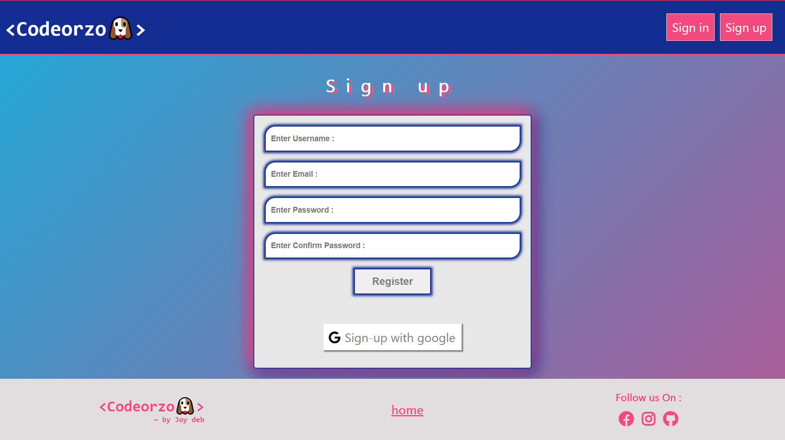

# codeorzo-app

# Codeial-A Social media website

## Description
It is a social media website which offers many cool features like a chat engine,a wall to share your posts and comments and a mailing service too.

## Screenshots

Home Page

Profile page

Edit profile

Mailer Notification on Post or Comment on Codeorzo Platform

scrnli_6_18_2021_11-01-29 PM.png

Sign Up Page

## Technologies Stack:

### Components
* HTML,CSS,Javascript,jQuery,Ajax,Sass
* Node.js,MongoDB,Express.js

### Insights

* passport-jwt strategy for authentication and authorization.
* passport-google-oauth2 strategy for social authentication through  google.
* used Nodemailer to send out emails.
* used socket.io for implementing chat engine.
